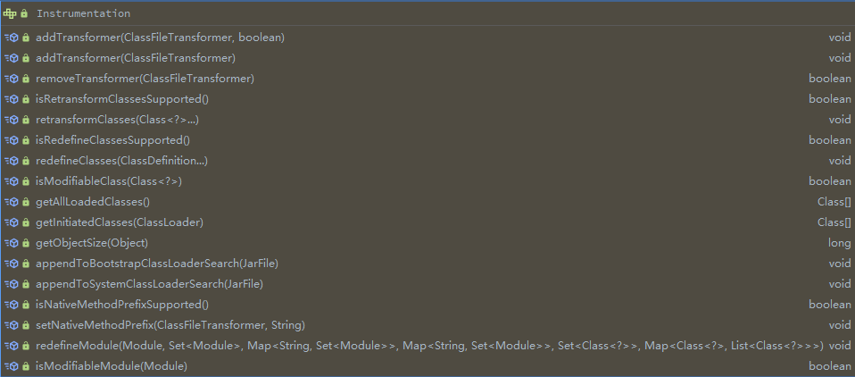

# Java Agent

## 简介

先说一下它的用途，在JDK1.5以后，我们可以使用agent技术构建一个独立于应用程序的代理程序（即为Agent），用来协助监测、运行甚至替换其他JVM上的程序。使用它可以实现虚拟机级别的AOP功能。Agent分为两种，一种是在主程序之前运行的Agent，一种是在主程序之后运行的Agent（前者的升级版，1.6以后提供）。

## 是什么

`java agent` 是一个JVM的**`插件`**,在java运行命令中 javaagent是一个参数，用来指定agent。javaagent是依赖java底层提供的一个叫instrument的JVMTI(Java Virtual Machine Tool Interface) Agent。这个agent又叫JPLISAgent(Java Programming Language Instrumentation Services Agent)

JVMTI是JDK提供的一套用于开发JVM监控, 问题定位与性能调优工具的通用编程接口（API）。 通过JVM TI，我们可以开发各式各样的JVMTI Agent。这个Agent的表现形式是一个以C/C++语言编写的动态共享库。 javaagent可以帮助我们快速使用JVMTI的功能，又不需要重写编写C/C++的底层库。

使用语法

```shell
java -jar -xxx.jar -javaagent:"agentJarPath/agnetJarName.jar"
```

## 能做什么

- 可以在加载class文件之前进行拦截并把字节码做修改。

- 可以在运行期对已加载类的字节码做变更，但是这种情况下会有很多的限制。

- 还有其他一些小众的功能

- - 获取所有已经加载过的类
  - 获取所有已经初始化过的类（执行过 clinit 方法，是上面的一个子集）
  - 获取某个对象的大小
  - 将某个jar加入到bootstrap classpath里作为高优先级被bootstrapClassloader 加载
  - 将某个jar加入到classpath里供AppClassloard去加载
  - 设置某些native方法的前缀，主要在查找native方法的时候做规则匹配

总的来说可以让JVM按照我们的预期逻辑去执行。

最主要的也是使用最广的功能就是对字节码的修改。通过对字节码的修改我们就可以实现对JAVA底层源码的重写，也正好可以满足我之前的需求。 我们还可以做：

- 完全非侵入式的进行**代码埋点**，进行**系统监控**
- 修改JAVA底层源码，进行JVM自定义
- 实现AOP动态代理

### 实例

- 自动添加getter/setter方法的工具lombok就使用了这一技术
- btrace、Arthas和housemd等动态诊断工具也是用了instrument技术
- Intellij idea 的 HotSwap、Jrebel 等也是该技术的实现之一
- pinpoint、skywalking、newrelic、听云的 APM 产品等都基于 Instrumentation 实现

## 实现原理

核心类`java.lang.instrument.Instrumentation`



对于javaagent类，它的`主函数前置启动方法（即main函数开始前的方法）`的方法签名有特定的要求，必须要满足以下两种格式：


#### instrument原理[#](https://www.cnblogs.com/rickiyang/p/11368932.html#1956184396)

`instrument`的底层实现依赖于`JVMTI(JVM Tool Interface)`，它是JVM暴露出来的一些供用户扩展的接口集合，JVMTI是基于事件驱动的，JVM每执行到一定的逻辑就会调用一些事件的回调接口（如果有的话），这些接口可以供开发者去扩展自己的逻辑。`JVMTIAgent`是一个利用`JVMTI`暴露出来的接口提供了代理启动时加载(agent on load)、代理通过attach形式加载(agent on attach)和代理卸载(agent on unload)功能的动态库。而`instrument agent`可以理解为一类`JVMTIAgent`动态库，别名是`JPLISAgent(Java Programming Language Instrumentation Services Agent)`，也就是**专门为java语言编写的插桩服务提供支持的代理**。

##### 启动时加载instrument agent过程：

1. 创建并初始化 JPLISAgent；
2. 监听 `VMInit` 事件，在 JVM 初始化完成之后做下面的事情：
   1. 创建 InstrumentationImpl 对象 ；
   2. 监听 ClassFileLoadHook 事件 ；
   3. 调用 InstrumentationImpl 的`loadClassAndCallPremain`方法，在这个方法里会去调用 javaagent 中 MANIFEST.MF 里指定的Premain-Class 类的 premain 方法 ；
3. 解析 javaagent 中 MANIFEST.MF 文件的参数，并根据这些参数来设置 JPLISAgent 里的一些内容。

##### 运行时加载instrument agent过程：

通过 JVM 的attach机制来请求目标 JVM 加载对应的agent，过程大致如下：

1. 创建并初始化JPLISAgent；
2. 解析 javaagent 里 MANIFEST.MF 里的参数；
3. 创建 InstrumentationImpl 对象；
4. 监听 ClassFileLoadHook 事件；
5. 调用 InstrumentationImpl 的`loadClassAndCallAgentmain`方法，在这个方法里会去调用javaagent里 MANIFEST.MF 里指定的`Agent-Class`类的`agentmain`方法。

#### Instrumentation的局限性[#](https://www.cnblogs.com/rickiyang/p/11368932.html#4245108122)

大多数情况下，我们使用Instrumentation都是使用其字节码插桩的功能，或者笼统说就是类重定义(Class Redefine)的功能，但是有以下的局限性：

1. premain和agentmain两种方式修改字节码的时机都是类文件加载之后，也就是说必须要带有Class类型的参数，不能通过字节码文件和自定义的类名重新定义一个本来不存在的类。
2. 类的字节码修改称为类转换(Class Transform)，类转换其实最终都回归到类重定义Instrumentation#redefineClasses()方法，此方法有以下限制：
   1. 新类和老类的父类必须相同；
   2. 新类和老类实现的接口数也要相同，并且是相同的接口；
   3. 新类和老类访问符必须一致。 新类和老类字段数和字段名要一致；
   4. 新类和老类新增或删除的方法必须是private static/final修饰的；
   5. 可以修改方法体。

除了上面的方式，如果想要重新定义一个类，可以考虑基于类加载器隔离的方式：创建一个新的自定义类加载器去通过新的字节码去定义一个全新的类，不过也存在只能通过反射调用该全新类的局限性。

## 案例

### 主程序运行之前

对于在主程序运行之前的方法，需要遵从以下命名

```java
1.public static void premain(String agentArgs, Instrumentation inst)
2.public static void premain(String agentArgs)
```

JVM 会优先加载 带 `Instrumentation` 签名的方法，加载成功忽略第二种，如果第一种没有，则加载第二种方法。加载逻辑在`sun.instrument.InstrumentationImpl#loadClassAndStartAgent`方法中，注释部分写清楚了加载顺序。

```java
// The agent class must have a premain or agentmain method that
// has 1 or 2 arguments. We check in the following order:
//
// 1) declared with a signature of (String, Instrumentation)
// 2) declared with a signature of (String)
// 3) inherited with a signature of (String, Instrumentation)
// 4) inherited with a signature of (String)
//
// So the declared version of either 1-arg or 2-arg always takes
// primary precedence over an inherited version. After that, the
// 2-arg version takes precedence over the 1-arg version.
//
// If no method is found then we throw the NoSuchMethodException
// from the first attempt so that the exception text indicates
// the lookup failed for the 2-arg method (same as JDK5.0).

try {
  m = javaAgentClass.getDeclaredMethod( methodname,new Class<?>[] {
    																				String.class,
    																				java.lang.instrument.Instrumentation.class
                                           }
                                      );
  twoArgAgent = true;
} catch (NoSuchMethodException x) {
  // remember the NoSuchMethodException
  firstExc = x;
}

if (m == null) {
  // now try the declared 1-arg method
  try {
    m = javaAgentClass.getDeclaredMethod(methodname,new Class<?>[] { String.class });
  } catch (NoSuchMethodException x) {
    // ignore this exception because we'll try
    // two arg inheritance next
  }
}

if (m == null) {
  // now try the inherited 2-arg method
  try {
    m = javaAgentClass.getMethod( methodname,
                                 new Class<?>[] {
                                   String.class,
                                   java.lang.instrument.Instrumentation.class
                                     }
                                );
    twoArgAgent = true;
  } catch (NoSuchMethodException x) {
    // ignore this exception because we'll try
    // one arg inheritance next
  }
}

if (m == null) {
  // finally try the inherited 1-arg method
  try {
    m = javaAgentClass.getMethod(methodname,
                                 new Class<?>[] { String.class });
  } catch (NoSuchMethodException x) {
    // none of the methods exists so we throw the
    // first NoSuchMethodException as per 5.0
    throw firstExc;
  }
}
```

使用maven新建一个项目，新建类`PreMainTraceAgent`

```java
public class PreMainTraceAgent {
 /**
  * 该方法在main方法之前运行，与main方法运行在同一个JVM中
  * 并被同一个System ClassLoader装载
  * 被统一的安全策略(security policy)和上下文(context)管理
  *
  */
	public static void premain(String agentArgs, Instrumentation instrumentation) {
		System.out.println("agentArgs: " + agentArgs);
		instrumentation.addTransformer(new PreMainTransformer());
	}
  
 /**
 	* 如果不存在 premain(String agentArgs, Instrumentation instrumentation) 
  * 则会执行 premain(String agentArgs)
  *
  */
	public static void premain(String agentArgs) {
		System.out.println("agentArgs: " + agentArgs);
	}

  
	public static class PreMainTransformer implements ClassFileTransformer {
		@Override
		public byte[] transform(ClassLoader loader, String className, Class<?> classBeingRedefined,
			ProtectionDomain protectionDomain, byte[] classfileBuffer) throws IllegalClassFormatException {
			System.out.println("premain load class : " + className);
			return classfileBuffer;
		}
	}

}
```

新增`MANIFEST.MF`

```shell
Manifest-Version: 1.0
Can-Redefine-Classes: true
Can-Retransform-Classes: true
Premain-Class: code.PreMainTraceAgent

```

新增`maven`打包插件 `maven-jar-plugin`

```xml
<plugin>
  <groupId>org.apache.maven.plugins</groupId>
  <artifactId>maven-jar-plugin</artifactId>
  <version>3.1.0</version>
  <configuration>
    <archive>
      <!--自动添加META-INF/MANIFEST.MF -->
      <manifest>
        <addClasspath>true</addClasspath>
      </manifest>
      <manifestEntries>
        <!--Premain-Class ：包含 premain 方法的类（类的全路径名）我们这里就是PreMainTraceAgent类 -->
        <Premain-Class>code.PreMainTraceAgent</Premain-Class>
        <!-- true表示能重定义此代理所需的类，默认值为 false（可选） -->
        <Can-Redefine-Classes>true</Can-Redefine-Classes>
        <!-- true表示能重转换此代理所需的类，默认值为 false （可选）-->
        <Can-Retransform-Classes>true</Can-Retransform-Classes>
      </manifestEntries>
    </archive>
  </configuration>
</plugin>
```

```properties
Premain-Class ：包含 premain 方法的类（类的全路径名）
Agent-Class ：包含 agentmain 方法的类（类的全路径名）
Boot-Class-Path ：设置引导类加载器搜索的路径列表。查找类的特定于平台的机制失败后，引导类加载器会搜索这些路径。按列出的顺序搜索路径。列表中的路径由一个或多个空格分开。路径使用分层 URI 的路径组件语法。如果该路径以斜杠字符（“/”）开头，则为绝对路径，否则为相对路径。相对路径根据代理 JAR 文件的绝对路径解析。忽略格式不正确的路径和不存在的路径。如果代理是在 VM 启动之后某一时刻启动的，则忽略不表示 JAR 文件的路径。（可选）
Can-Redefine-Classes ：true表示能重定义此代理所需的类，默认值为 false（可选）
Can-Retransform-Classes ：true 表示能重转换此代理所需的类，默认值为 false （可选）
Can-Set-Native-Method-Prefix： true表示能设置此代理所需的本机方法前缀，默认值为 false（可选）
```


使用`maven clean package`进行打包，在`target`目录下找到对应的`jar`包，然后新开一个程序，写一个带`main`方法的程序，通过命令行方式传参，启动该程序,即可观察到结果

测试代码

```java

public class AgentTest {

    public static void main(String[] args) {
        System.out.println("hi agent");
    }

}
```

```shell
java -jar -javaagent:C:\Users\Administrator\Documents\code\java-agent\target\my-agent.jar
```

运行结果

上面的输出结果我们能够发现：

1. 执行main方法之前会加载所有的类，包括系统类和自定义类；
2. 在ClassFileTransformer中会去拦截系统类和自己实现的类对象；
3. 如果你有对某些类对象进行改写，那么在拦截的时候抓住该类使用字节码编译工具即可实现。

```java
agentArgs: null //没有参数
premain load class : jdk/internal/loader/URLClassPath$JarLoader
premain load class : java/lang/WeakPairMap$Pair$Weak
......
premain load class : java/net/InetAddress
premain load class : code/PreAgentTest  // 测试类会先加载
premain load class : java/net/InetAddress$1
Pre agent test  //加载完了后才会输出这句话
premain load class : java/util/IdentityHashMap$KeyIterator
```


### 主程序运行之后动态Instrument

对于在主程序运行之后的方法，需要遵从以下命名

```java
//采用attach机制，被代理的目标程序VM有可能很早之前已经启动，当然其所有类已经被加载完成，
//这个时候需要借助Instrumentation#retransformClasses(Class<?>... classes)让对应的类可以重新转换
//从而激活重新转换的类执行ClassFileTransformer列表中的回调
1.public static void agentmain (String agentArgs, Instrumentation inst)
2.public static void agentmain (String agentArgs)
```

JVM 会优先加载 带 `Instrumentation` 签名的方法，加载成功忽略第二种，如果第一种没有，则加载第二种方法。

在Java6 以后实现启动后加载的新实现是Attach api。Attach API 很简单，只有 2 个主要的类，都在 `com.sun.tools.attach` 包里面：

1. `VirtualMachine` 字面意义表示一个Java 虚拟机，也就是程序需要监控的目标虚拟机，提供了获取系统信息(比如获取内存dump、线程dump，类信息统计(比如已加载的类以及实例个数等)， loadAgent，Attach 和 Detach （Attach 动作的相反行为，从 JVM 上面解除一个代理）等方法，可以实现的功能可以说非常之强大 。该类允许我们通过给attach方法传入一个jvm的pid(进程id)，远程连接到jvm上 。

   代理类注入操作只是它众多功能中的一个，通过`loadAgent`方法向jvm注册一个代理程序agent，在该agent的代理程序中会得到一个Instrumentation实例，该实例可以 在class加载前改变class的字节码，也可以在class加载后重新加载。在调用Instrumentation实例的方法时，这些方法会使用ClassFileTransformer接口中提供的方法进行处理。

2. `VirtualMachineDescriptor` 则是一个描述虚拟机的容器类，配合 VirtualMachine 类完成各种功能。

attach实现动态注入的原理如下：

通过VirtualMachine类的`attach(pid)`方法，便可以attach到一个运行中的java进程上，之后便可以通过`loadAgent(agentJarPath)`来将agent的jar包注入到对应的进程，然后对应的进程会调用agentmain方法。


既然是两个进程之间通信那肯定的建立起连接，VirtualMachine.attach动作类似TCP创建连接的三次握手，目的就是搭建attach通信的连接。而后面执行的操作，例如vm.loadAgent，其实就是向这个socket写入数据流，接收方target VM会针对不同的传入数据来做不同的处理。

新建一个`maven`项目，新建类`AgentMainTrace`

```java
package code;

import java.lang.instrument.ClassFileTransformer;
import java.lang.instrument.IllegalClassFormatException;
import java.lang.instrument.Instrumentation;
import java.security.ProtectionDomain;

public class AgentMainTrace {

	public static void agentmain(String agentArgs, Instrumentation instrumentation) {
		instrumentation.addTransformer(new MyAgentMainTransform(), true);
	}

	static class MyAgentMainTransform implements ClassFileTransformer {
		@Override
		public byte[] transform(ClassLoader loader, String className, Class<?> classBeingRedefined,
			ProtectionDomain protectionDomain, byte[] classfileBuffer) throws IllegalClassFormatException {
			System.out.println("agentmain load class: " + className);
			return classfileBuffer;
		}
	}
}


```

新增`MANIFEST.MF`

```properties
Manifest-Version: 1.0
Can-Redefine-Classes: true
Can-Retransform-Classes: true
Agent-Class: code.AgentMainTrace
```

新增`maven`打包插件 `maven-jar-plugin`

```xml
<plugin>
  <groupId>org.apache.maven.plugins</groupId>
  <artifactId>maven-jar-plugin</artifactId>
  <version>3.1.0</version>
  <configuration>
    <archive>
      <!--自动添加META-INF/MANIFEST.MF -->
      <manifest>
        <addClasspath>true</addClasspath>
      </manifest>
      <manifestEntries>
        <!--AgentMain-Class ：包含 agentmain 方法的类（类的全路径名）我们这里就是AgentMainTrace类 -->
        <Premain-Class>code.AgentMainTrace</Premain-Class>
        <!-- true表示能重定义此代理所需的类，默认值为 false（可选） -->
        <Can-Redefine-Classes>true</Can-Redefine-Classes>
        <!-- true表示能重转换此代理所需的类，默认值为 false （可选）-->
        <Can-Retransform-Classes>true</Can-Retransform-Classes>
      </manifestEntries>
    </archive>
  </configuration>
</plugin>
```

```properties
Premain-Class ：包含 premain 方法的类（类的全路径名）
Agent-Class ：包含 agentmain 方法的类（类的全路径名）
Boot-Class-Path ：设置引导类加载器搜索的路径列表。查找类的特定于平台的机制失败后，引导类加载器会搜索这些路径。按列出的顺序搜索路径。列表中的路径由一个或多个空格分开。路径使用分层 URI 的路径组件语法。如果该路径以斜杠字符（“/”）开头，则为绝对路径，否则为相对路径。相对路径根据代理 JAR 文件的绝对路径解析。忽略格式不正确的路径和不存在的路径。如果代理是在 VM 启动之后某一时刻启动的，则忽略不表示 JAR 文件的路径。（可选）
Can-Redefine-Classes ：true表示能重定义此代理所需的类，默认值为 false（可选）
Can-Retransform-Classes ：true 表示能重转换此代理所需的类，默认值为 false （可选）
Can-Set-Native-Method-Prefix： true表示能设置此代理所需的本机方法前缀，默认值为 false（可选）
```


## :warning:注意事项


（1）如果你把 -javaagent 放在 -jar 后面，则不会生效。也就是说，放在主程序后面的 agent 是无效的。比如执行：

```shell
java -javaagent:G:\myagent.jar=Hello1 -javaagent:G:\myagent.jar=Hello2 -jar myapp.jar -javaagent:G:\myagent.jar=Hello3
```

